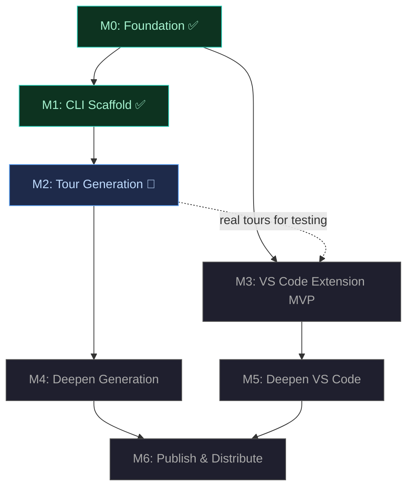

# tourguide — Milestone Roadmap

> **For AI agents:** This document drives execution. Read the status overview to understand where the project is, then jump to the current milestone card for your session's scope. Respect the key decisions — they are settled choices, not suggestions.

---

## Status Overview

| Milestone | Status | Goal |
|-----------|--------|------|
| **M0: Foundation** | ✅ Done | Format schema, validation, core traversal/graph/resolver |
| **M1: CLI Scaffold** | ✅ Done | CLI with validate/play/summary, hardened foundation |
| **M2: Tour Generation** | 🔵 Active | Agentic generation — `generate --diff` produces valid tours from real PRs |
| **M3: VS Code Extension MVP** | Upcoming | Rich interactive visualization — overview, guided play, decorations |
| **M4: Deepen Generation** | Upcoming | Model tiering, codebase mode, feedback loop, large diff handling |
| **M5: Deepen VS Code** | Upcoming | Connections nav, file explorer badges, breadcrumbs, ghost annotations |
| **M6: Publish & Distribute** | Upcoming | npm packages, VS Code Marketplace, CI, polished docs |

**Dependency notes:** M4 and M5 are independent — work in either order. M3 soft-depends on M2 (real generated tours improve testing, but hand-crafted fixtures work). The critical path to end-to-end is M0 → M1 → M2 → M3.

---

## Completed Milestones

<strong>M0: Foundation</strong> ✅ — Format schema, validation, core traversal/graph/resolver

**What was delivered:**

`@tourguide/format` provides Zod schemas for the full `.tourguide` format (discriminated union on `mode`: diff vs codebase), inferred TypeScript types, semantic validation with referential integrity checks (chapter references, annotation references, connection endpoints), and JSON Schema generation (Draft-07).

`@tourguide/core` provides tour loading/parsing from files or strings with structured error reporting, a connection graph with adjacency list indexing (outgoing, incoming, related, byType queries), linear traversal with chapter/step navigation and progress tracking, and source range/pattern resolution for mapping steps to file contents.

Both packages have test suites covering happy paths, edge cases, and error conditions. Example `.tourguide` files exist in `examples/` and `packages/core/tests/fixtures/`.

**Known gaps addressed in M1:**
- `buildGraph` now merges both top-level and per-step `connections` into a unified graph with deduplication
- Traversal gracefully handles empty chapters (skips them) and empty tours (returns null positions)

<strong>M1: CLI Scaffold</strong> ✅ — CLI with validate/play/summary, hardened foundation

**What was delivered:**

`@tourguide/cli` provides a `tourguide` binary with three commands:

- `tourguide validate <files...>` — loads and validates `.tourguide` files, reporting both schema and semantic errors with clear output
- `tourguide summary <file>` — prints tour overview: title, description, mode, chapters with step counts, file map with relevance levels
- `tourguide play <file>` — interactive terminal walkthrough: Enter/right-arrow advances, q quits. Displays chapter progress, step title, file path/range, description, and resolved code snippets. Raw mode stdin, non-TTY fallback.

Built with commander.js and chalk. Output is pipe-friendly (colors auto-disabled when not a TTY). Proper `--help`, `--version`, and non-zero exit codes.

Foundation fixes delivered alongside:
- `buildGraph` in `@tourguide/core` now merges top-level and per-step connections with deduplication
- Traversal handles empty chapters and empty tours gracefully
- Injectable `Output` abstraction for testable CLI output

Test suites cover all CLI commands and foundation fixes.

---

## Active and Upcoming Milestones

## M2: Tour Generation

**Status:** 🔵 Active
**Depends on:** M1
**Design spec:** [`docs/superpowers/specs/2026-04-07-tour-generation-design.md`](superpowers/specs/2026-04-07-tour-generation-design.md)
**Goal:** `tourguide generate --diff base..head` produces valid, meaningful `.tourguide` files from real git diffs using agentic LLM generation. This is the first real-world test — generating a tour from an actual PR.

### Acceptance Criteria

- [ ] `tourguide generate --diff base..head` uses an agentic discovery loop (LLM with codebase tools) followed by a narration call to produce a valid `.tourguide` JSON document
- [ ] Generated tours include: an overview with summary and file map, chapters grouping logically related changes, steps anchored to specific code ranges with descriptive titles and markdown descriptions, and connections between related steps
- [ ] The generated output passes `tourguide validate` with no errors
- [ ] Successfully generates a meaningful, well-organized, understandable tour from a real multi-file PR (not just a toy example)
- [ ] Vendor-agnostic LLM integration via the Vercel AI SDK. Provider and model configurable via `--provider` and `--model` flags. Anthropic is the default provider.
- [ ] Generation errors (git failures, LLM API errors, validation failure after retry) produce clear error messages and non-zero exit codes

### Key Decisions

- **Agentic discovery, not structural analysis.** No deterministic diff parsing or import tracing. The LLM receives the raw diff and explores the codebase autonomously using tools (read file at ref, search codebase, list directory, git log, git blame). It decides what's relevant. This produces better understanding than any heuristic we'd build, and naturally extends to codebase mode in M4.
- **Two-call pipeline: discovery → narration.** Call 1 (`generateText` + tools): the model explores the codebase and produces a free-form synthesis of the changes. Call 2 (`generateObject` + `tourSchema`): the model receives the synthesis + raw diff + Zod schema and produces the tour as a validated object. Separating comprehension from structuring gives each call a clear objective.
- **Vendor-agnostic via Vercel AI SDK.** The `ai` package provides a unified interface across providers (Anthropic, OpenAI, Google, etc.) with first-class tool use and structured output. Anthropic ships as a default dependency; other providers require installing their SDK package.
- **The narrating LLM has full creative agency.** It may reorganize by conceptual theme, skip boilerplate, group cross-file changes into narrative threads, and add architectural context. The goal is an engaging, understandable tour — not a mechanical hunk walk-through.
- **Output: stdout by default, `--output` for file.** Tour JSON to stdout, progress/warnings to stderr (pipeable). Validation + one retry on semantic errors. Best-effort output on retry failure (valid JSON with semantic warnings).
- **Separate `packages/generate/` library.** The generation pipeline (`@tourguide/generate`) is a standalone library. The CLI's `generate` command is a thin wrapper. This keeps the library usable programmatically for future CI integration, VS Code, etc.

### Context

New package: `packages/generate/` with dependencies on `ai`, `@ai-sdk/anthropic`, and `@tourguide/format`. The CLI gets a new `generate` command wiring the library to flags.

The `examples/sample.tourguide` file demonstrates the target output shape. Test tools against a fixture git repo; gated LLM integration tests verify the full pipeline.

---

## M3: VS Code Extension MVP

**Status:** Upcoming
**Depends on:** M0 (hard), M2 (soft — real generated tours improve testing)
**Goal:** Rich interactive visualization of `.tourguide` files in VS Code. Overview graph, guided play, narrative panel, gutter decorations. This is where humans experience tours.

### Acceptance Criteria

- [ ] Extension activates when a `.tourguide/` directory or any `.tourguide` file exists in the workspace
- [ ] **Tour Explorer** tree view in the sidebar lists available tours, chapters within each tour, and steps within each chapter. Clicking a step navigates to its file and range.
- [ ] **Overview panel** (webview) shows the tour's summary text, the file map with relevance color coding, and a rendered Mermaid diagram. Clicking a node in the diagram navigates to the corresponding chapter or step.
- [ ] **Guided play mode** activated from the overview or via command palette. Next/prev step keyboard shortcuts. The editor auto-navigates to each step's file, scrolls to the range, and highlights it. Next/prev chapter shortcuts jump to the first step of the adjacent chapter. Current position persists across file switches.
- [ ] **Narrative panel** in the bottom of the editor (webview) displays: current chapter title and progress (e.g., "2/4: Data Validation"), step title, step description rendered as markdown. Visible regardless of which file the user is viewing.
- [ ] **Gutter decorations** on annotated lines — colored dots where color indicates annotation category (modified, entry-point, data-flow, side-effect, context). Hovering over a decoration shows the annotation text.
- [ ] Extension loads tours without blocking the editor. Large tours don't cause lag.

### Key Decisions

- **Overview panel: VS Code webview panel.** Mermaid diagrams rendered client-side via mermaid.js bundled in the webview. The webview communicates with the extension host via `postMessage` for navigation events (user clicks a diagram node → extension navigates the editor). The webview retains state when hidden.
- **Narrative panel: webview in the bottom panel area.** Not an OutputChannel — those don't support rich rendering. Not a sidebar webview — the narrative should be visible alongside the code. A webview panel placed in the `ViewColumn.Two` bottom group (or a WebviewView registered for the panel area). Renders markdown with a lightweight library (e.g., marked).
- **Tree view: standard TreeDataProvider API.** Three levels: tour → chapter → step. Step items show the step title and an icon indicating the step kind. Chapter items show the chapter title and step count. Implements `reveal()` to sync the tree with guided play position.
- **Bundling: esbuild for the extension host.** `@tourguide/format` and `@tourguide/core` are bundled into the extension — not listed as VS Code extension dependencies. The webview assets (mermaid.js, CSS) are included in the extension package.
- **No external runtime dependencies.** No telemetry. No network calls. The extension works fully offline. The only third-party code in the webview is mermaid.js for diagram rendering.
- **Packaging: vsce.** The extension is packaged as a `.vsix` for local installation during development and later published to the Marketplace in M6.

### Context

The `packages/vscode/` directory doesn't exist yet. VS Code extension development requires:

- A `package.json` with the `engines.vscode` field, `activationEvents`, `contributes` (commands, views, keybindings, menus)
- Extension entry point (`src/extension.ts`) with `activate` and `deactivate` exports
- `@types/vscode` as a dev dependency (not bundled — provided by the editor at runtime)
- esbuild configuration for bundling

The extension consumes `@tourguide/format` (for types and validation) and `@tourguide/core` (for loading, traversal, graph, resolution) — bundled in via esbuild.

Test with hand-crafted `.tourguide` files from `examples/` and fixtures. If M2 is complete, also test with real generated tours.

---

## M4: Deepen Generation

**Status:** Upcoming
**Depends on:** M2
**Goal:** Model tiering, codebase mode, feedback loop, large diff handling, pattern anchoring. Make generation smarter, cheaper, and more capable.

M4 bundles generation milestones G2–G5 from the [generation design spec](superpowers/specs/2026-04-07-tour-generation-design.md).

### Acceptance Criteria

- [ ] **Model tiering (G2):** Discovery becomes a two-tier system — a frontier model (Opus-class) orchestrates and synthesizes, workhorse subagents (Sonnet/Haiku-class) execute targeted code reading and summarization. `--discovery-model` and `--narration-model` flags.
- [ ] **Feedback loop (G3):** `--feedback "..."` flag lets the user improve a previous generation. Narration is re-run with the feedback; discovery is skipped by default, optionally re-run with `--rediscover`.
- [ ] **Codebase mode (G4):** `tourguide generate --files src/api/ src/models/` explores existing code (no git diff) and generates a tour explaining the feature area. Same discovery loop, seeded with file contents. Output uses `mode: "codebase"`.
- [ ] **Large diff handling (G5):** PRs exceeding context windows are handled via chunked discovery with merged synthesis, producing a coherent single tour.
- [ ] **Pattern anchoring:** Generated steps include regex `pattern` fields anchored to unique code near the step's range, so tours survive minor line number shifts.

### Key Decisions

- **Tiered discovery: frontier orchestrator + workhorse readers.** The frontier model never reads 2000-line files directly; it formulates targeted questions and receives focused summaries from cheaper subagents. This optimizes cost while maintaining high synthesis quality.
- **Codebase mode reuses the same discovery loop.** The only difference is the seed: file contents instead of a diff. The narration call is identical.
- **Pattern generation is a post-processing step.** After the tour is generated, a pass analyzes source files and adds `pattern` fields. Patterns prefer stable anchors: function signatures, class names, distinctive string literals.

### Context

Builds directly on M2's agentic generation pipeline. The Vercel AI SDK's provider abstraction makes model tiering straightforward — the frontier and workhorse models can even be from different providers.

---

## M5: Deepen VS Code

**Status:** Upcoming
**Depends on:** M3
**Goal:** Full navigation capabilities, file explorer integration, and persistent annotations. Make the VS Code experience feel complete.

### Acceptance Criteria

- [ ] **Jump to related:** from any step, a command/UI shows outgoing connections with their types (calls, imports, triggers...) and navigates to the target step or annotation on click
- [ ] **File explorer decorations:** files that are part of the active tour show badges/color in the standard VS Code Explorer. Color intensity or badge text indicates relevance (`primary` = prominent, `secondary` = visible, `context` = subtle).
- [ ] **Breadcrumb trail:** a navigation bar (in the narrative panel or as a separate element) shows the path: overview → chapter → step. Click any breadcrumb to jump back to that level.
- [ ] **Ghost annotations:** when a tour is loaded but guided play is not active, annotated lines still show reduced-opacity gutter decorations and hover content. This is the "persistent layer" that keeps tour context visible during manual exploration.
- [ ] **Configurable keyboard shortcuts** via VS Code's standard keybinding settings. All tour-related commands are rebindable.

### Key Decisions

- **File decorations: FileDecorationProvider API.** Register a provider that reads the active tour's file map and applies decorations based on the `relevance` field. Uses VS Code's built-in badge and color APIs — no custom rendering needed.
- **Connections panel:** When the current step has outgoing connections, display them as a clickable list in the narrative panel (below the step description). Each entry shows the connection type, the target step title, and the target file. Clicking navigates. This keeps connections visible in context rather than buried in a separate panel.
- **Ghost annotations: reduced-opacity gutter decorations.** Use a separate `TextEditorDecorationType` with lower alpha values. The same hover content as full-opacity decorations. Always active when a tour is loaded — they activate on `activate`, not on "start guided play."

### Context

Builds on M3's extension infrastructure. Most features map directly to well-documented VS Code APIs:

- `FileDecorationProvider` for explorer badges
- `TextEditorDecorationType` for ghost annotations (same mechanism as M3's gutter decorations, different styling)
- `keybindings` contribution point for configurable shortcuts
- Breadcrumbs can be implemented as part of the narrative panel webview (simplest) or as a custom `WebviewView` in the editor title area

---

## M6: Publish & Distribute

**Status:** Upcoming
**Depends on:** M4, M5
**Goal:** Ship it. npm packages, VS Code Marketplace, zero-install CLI, CI pipeline, polished documentation.

### Acceptance Criteria

- [ ] `@tourguide/format`, `@tourguide/core`, and `@tourguide/cli` published to npm under the `@tourguide` org
- [ ] `npx tourguide generate --diff main..HEAD` works for zero-install usage
- [ ] VS Code extension published to the Marketplace and installable via the Extensions view
- [ ] CI pipeline on GitHub Actions: test + lint + build on every PR, publish to npm + Marketplace triggered by git tag
- [ ] `README.md` is polished: project description, installation, quickstart guide, screenshots or GIFs of the VS Code experience, links to `docs/vision.md`
- [ ] `CHANGELOG.md` exists with entries for each milestone's notable changes
- [ ] All package `README.md` files are complete (brief description, installation, usage, API reference for libraries)

### Key Decisions

- **npm org: `@tourguide`.** Register the org on npm. Package names: `@tourguide/format`, `@tourguide/core`, `@tourguide/cli`.
- **VS Code Marketplace publisher: `tourguide`.** Extension ID: `tourguide.tourguide` (subject to availability).
- **CI: GitHub Actions.** Two workflows: (1) `ci.yml` — runs on every PR and push to main: install, build, lint, test across all packages. (2) `release.yml` — triggered by pushing a version tag (e.g., `v0.2.0`): builds, publishes npm packages, packages and publishes the VS Code extension.
- **Publish is manual.** Triggered by tagging a release, not automatic on merge to main. This keeps control over what ships and allows batching multiple changes into a single release.
- **Versioning:** All packages share the same version number (monorepo-style). Bumped per release, not per package.

### Context

Publishing infrastructure:

- npm: requires an npm token with publish access to the `@tourguide` org. Set as `NPM_TOKEN` GitHub Actions secret.
- VS Code Marketplace: requires a Personal Access Token from Azure DevOps. Set as `VSCE_PAT` GitHub Actions secret. Use `vsce publish` in the release workflow.
- The `@tourguide/cli` package needs a `"bin"` field pointing to the built CLI entry point for `npx` support.
- All three library packages already use tsup for building ESM+CJS. The extension uses esbuild.
