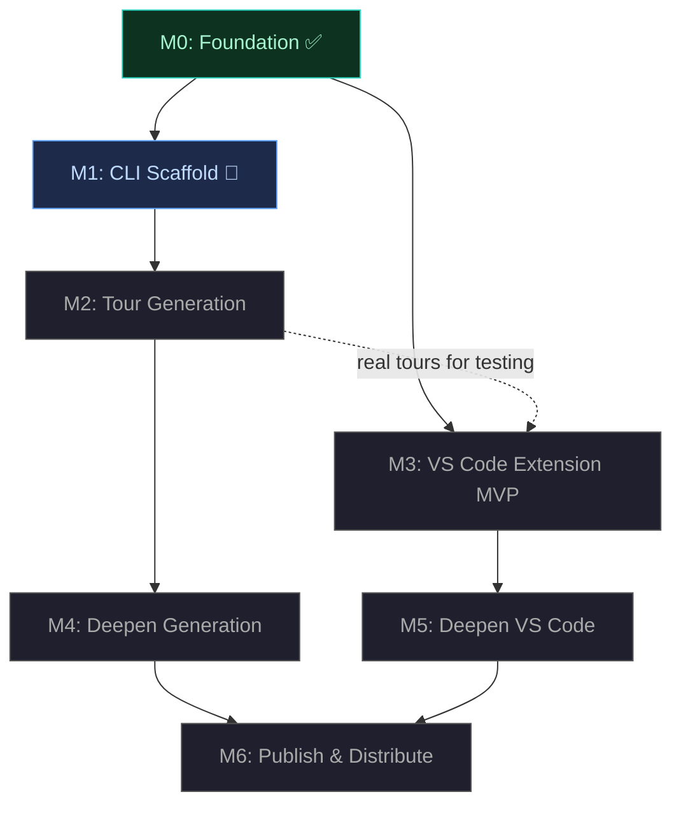

# tourguide — Milestone Roadmap

> **For AI agents:** This document drives execution. Read the status overview to understand where the project is, then jump to the current milestone card for your session's scope. Respect the key decisions — they are settled choices, not suggestions.

---

## Status Overview

| Milestone | Status | Goal |
|-----------|--------|------|
| **M0: Foundation** | ✅ Done | Format schema, validation, core traversal/graph/resolver |
| **M1: CLI Scaffold** | 🔵 Next | Stand up CLI with validate/play/summary, harden the foundation |
| **M2: Tour Generation** | Upcoming | `generate --diff` produces valid tours from real PRs |
| **M3: VS Code Extension MVP** | Upcoming | Rich interactive visualization — overview, guided play, decorations |
| **M4: Deepen Generation** | Upcoming | Codebase mode, pattern anchoring, multi-model cost optimization |
| **M5: Deepen VS Code** | Upcoming | Connections nav, file explorer badges, breadcrumbs, ghost annotations |
| **M6: Publish & Distribute** | Upcoming | npm packages, VS Code Marketplace, CI, polished docs |

**Dependency notes:** M4 and M5 are independent — work in either order. M3 soft-depends on M2 (real generated tours improve testing, but hand-crafted fixtures work). The critical path to end-to-end is M0 → M1 → M2 → M3.

---

## Completed Milestones

<strong>M0: Foundation</strong> ✅ — Format schema, validation, core traversal/graph/resolver

**What was delivered:**

`@tourguide/format` provides Zod schemas for the full `.tourguide` format (discriminated union on `mode`: diff vs codebase), inferred TypeScript types, semantic validation with referential integrity checks (chapter references, annotation references, connection endpoints), and JSON Schema generation (Draft-07).

`@tourguide/core` provides tour loading/parsing from files or strings with structured error reporting, a connection graph with adjacency list indexing (outgoing, incoming, related, byType queries), linear traversal with chapter/step navigation and progress tracking, and source range/pattern resolution for mapping steps to file contents.

Both packages have test suites covering happy paths, edge cases, and error conditions. Example `.tourguide` files exist in `examples/` and `packages/core/tests/fixtures/`.

**Known gaps to address in M1:**
- `buildGraph` only indexes top-level `connections`, not per-step `connections` arrays — consumers may expect a unified graph
- Traversal doesn't guard against empty chapters or empty tours (will throw on `firstPosition`)
- Format schema may need adjustments as CLI and generation work reveals gaps

---

## Active and Upcoming Milestones

## M1: CLI Scaffold

**Status:** 🔵 Next up
**Depends on:** M0
**Goal:** Stand up `@tourguide/cli` with consumption commands (validate, play, summary) and harden the foundation packages where gaps are discovered.

### Acceptance Criteria

- [ ] `tourguide validate <file>` parses and validates a `.tourguide` file, reporting both schema errors (malformed JSON, missing fields, wrong types) and semantic errors (dangling chapter references, unknown annotation refs, broken connection endpoints) with clear, actionable output
- [ ] `tourguide play <file>` presents the tour interactively in the terminal — Enter advances to the next step, q quits. Each step displays: chapter title and progress (e.g., "Chapter 2/4: Data Validation"), step number and total (e.g., "Step 3/12"), step title, file path and line range, and the step description. Chapter transitions are visually distinct.
- [ ] `tourguide summary <file>` prints the tour overview: title, description, mode, summary text, chapter list with step counts, and the file map with relevance levels
- [ ] `buildGraph` in `@tourguide/core` merges both top-level `connections` and per-step `connections` into a unified graph. Duplicate edges (same from/to/type) are deduplicated.
- [ ] Traversal in `@tourguide/core` gracefully handles empty chapters (skip them) and empty tours (return null positions instead of throwing)
- [ ] Proper `--help` for all commands, `--version` flag, non-zero exit codes on validation failure or file errors
- [ ] All existing tests still pass; new tests cover CLI commands, buildGraph merge behavior, and traversal edge cases

### Key Decisions

- **CLI framework: commander.js.** Standard, lightweight, excellent documentation. The CLI is simple enough that heavier frameworks (yargs, oclif) add complexity without benefit. commander.js supports subcommands, options parsing, and auto-generated help out of the box.
- **Terminal output: chalk for colors, pipe-friendly.** Output should be readable when piped to a file or another tool — disable colors when stdout is not a TTY (chalk does this automatically). No heavy TUI framework (ink, blessed). The terminal experience should be simple and reliable; the rich experience lives in VS Code.
- **Play mode: Enter-to-advance with readline.** Not a full terminal UI. `process.stdin` in raw mode, Enter advances, q quits. Displays are printed sequentially (clear screen between steps or use separator lines — agent's choice based on what reads better). This keeps the implementation simple and avoids terminal compatibility issues.
- **Package identity:** `@tourguide/cli` on npm, binary name `tourguide`. Registered in `package.json` under `"bin": { "tourguide": "./dist/cli.js" }`.
- **Foundation fixes live in this milestone** because the CLI exercises the full format+core stack end-to-end. The `play` command exercises traversal. The `validate` command exercises schema + semantic validation. The graph merge fix ensures that tours with per-step connections (which the format explicitly supports) work correctly.

### Context

The CLI package doesn't exist yet. Create `packages/cli/` following the conventions established by `packages/format/` and `packages/core/`:

- `tsconfig.json` extending `../../tsconfig.base.json` with project references to `../format` and `../core`
- `package.json` with tsup build, vitest test script, workspace dependencies on `@tourguide/format` and `@tourguide/core`
- Source in `src/`, tests in `tests/`
- Biome for linting/formatting (inherits root `biome.json`)

Test the CLI commands against the existing fixture files: `examples/sample.tourguide`, `packages/core/tests/fixtures/minimal.tourguide`, `packages/core/tests/fixtures/invalid.tourguide`.

---

## M2: Tour Generation

**Status:** Upcoming
**Depends on:** M1
**Goal:** `tourguide generate --diff base..head` produces valid, meaningful `.tourguide` files from real git diffs. This is the first real-world test — generating a tour from an actual PR.

### Acceptance Criteria

- [ ] `tourguide generate --diff base..head` reads the git diff between two refs, runs structural analysis, calls the LLM, and outputs a valid `.tourguide` JSON document
- [ ] Generated tours include: an overview with summary and file map, chapters grouping logically related changes, steps anchored to specific code ranges in the diff with descriptive titles and markdown descriptions, and connections between related steps
- [ ] The generated output passes `tourguide validate` with no errors
- [ ] Successfully generates a meaningful, well-organized, understandable tour from a real multi-file PR (not just a toy example)
- [ ] The LLM provider and model are configurable via `--model` flag and/or `TOURGUIDE_MODEL` environment variable
- [ ] Generation errors (git failures, LLM API errors, invalid LLM output) produce clear error messages and non-zero exit codes

### Key Decisions

- **Two-phase pipeline: structural analysis → narration.** Phase 1 (structural analysis) is deterministic — no LLM. It parses the git diff output, extracts hunks grouped by file, identifies file roles (new, modified, deleted, renamed), reads file contents at both refs to understand context, and traces relationships between changed files (imports, function calls). It produces a structured JSON summary of the diff. Phase 2 (narration) sends this summary to an LLM along with the JSON Schema and instructions.
- **The narration LLM has full creative agency.** The structural analysis provides the raw material: hunks, file relationships, module boundaries. But the narrating LLM is an author, not a formatter. It may reorganize material into chapters by conceptual theme rather than file boundary. It may skip or de-emphasize uninteresting changes (boilerplate, auto-generated code, trivial renames). It may group changes that span multiple files into a single narrative thread. It may add architectural context that the structural analysis can't derive. The goal is an engaging, understandable tour — not a mechanical walk through each hunk. The structural analysis tells the LLM what changed; the LLM decides how to explain it.
- **LLM integration: Anthropic Claude API first.** Use the Anthropic TypeScript SDK (`@anthropic-ai/sdk`). Model configurable via `--model` flag (default: `claude-sonnet-4-20250514` or current best) or `TOURGUIDE_MODEL` env var. API key via `ANTHROPIC_API_KEY` env var. Start with a single model for the entire narration; multi-model cost optimization is M4.
- **Prompt strategy: JSON Schema + structural analysis + clear intent.** The system prompt includes the full JSON Schema so the LLM knows the exact target structure. The user message includes the structural analysis output. The instructions emphasize: this tour is for comprehension (not code review), descriptions should explain *why* not just *what*, the LLM should organize for human understanding, and the output must be valid JSON matching the schema.
- **Output: stdout by default, `--output` for file.** The full tour is generated, validated with `tourguide validate`, and then output. If the LLM produces invalid JSON or the tour fails validation, retry once. If it still fails, report the errors and exit non-zero. No streaming.

### Context

This is the most complex milestone. It introduces two new capability areas:

1. **Git integration** — parsing `git diff` output, reading file contents at specific refs (`git show ref:path`). The structural analysis needs to handle unified diff format, extract hunk headers, and identify file-level metadata (new/modified/deleted/renamed). Consider using a diff parsing library or writing a focused parser.

2. **LLM API integration** — calling the Anthropic API, handling rate limits and errors, parsing the response as JSON. The prompt engineering is critical: the LLM needs enough context to produce a good tour but not so much that it exceeds context limits for large diffs.

The `examples/sample.tourguide` file demonstrates the target output shape. Test with small diffs first (2-3 files), then scale to the real PR.

---

## M3: VS Code Extension MVP

**Status:** Upcoming
**Depends on:** M0 (hard), M2 (soft — real generated tours improve testing)
**Goal:** Rich interactive visualization of `.tourguide` files in VS Code. Overview graph, guided play, narrative panel, gutter decorations. This is where humans experience tours.

### Acceptance Criteria

- [ ] Extension activates when a `.tourguide/` directory or any `.tourguide` file exists in the workspace
- [ ] **Tour Explorer** tree view in the sidebar lists available tours, chapters within each tour, and steps within each chapter. Clicking a step navigates to its file and range.
- [ ] **Overview panel** (webview) shows the tour's summary text, the file map with relevance color coding, and a rendered Mermaid diagram. Clicking a node in the diagram navigates to the corresponding chapter or step.
- [ ] **Guided play mode** activated from the overview or via command palette. Next/prev step keyboard shortcuts. The editor auto-navigates to each step's file, scrolls to the range, and highlights it. Next/prev chapter shortcuts jump to the first step of the adjacent chapter. Current position persists across file switches.
- [ ] **Narrative panel** in the bottom of the editor (webview) displays: current chapter title and progress (e.g., "2/4: Data Validation"), step title, step description rendered as markdown. Visible regardless of which file the user is viewing.
- [ ] **Gutter decorations** on annotated lines — colored dots where color indicates annotation category (modified, entry-point, data-flow, side-effect, context). Hovering over a decoration shows the annotation text.
- [ ] Extension loads tours without blocking the editor. Large tours don't cause lag.

### Key Decisions

- **Overview panel: VS Code webview panel.** Mermaid diagrams rendered client-side via mermaid.js bundled in the webview. The webview communicates with the extension host via `postMessage` for navigation events (user clicks a diagram node → extension navigates the editor). The webview retains state when hidden.
- **Narrative panel: webview in the bottom panel area.** Not an OutputChannel — those don't support rich rendering. Not a sidebar webview — the narrative should be visible alongside the code. A webview panel placed in the `ViewColumn.Two` bottom group (or a WebviewView registered for the panel area). Renders markdown with a lightweight library (e.g., marked).
- **Tree view: standard TreeDataProvider API.** Three levels: tour → chapter → step. Step items show the step title and an icon indicating the step kind. Chapter items show the chapter title and step count. Implements `reveal()` to sync the tree with guided play position.
- **Bundling: esbuild for the extension host.** `@tourguide/format` and `@tourguide/core` are bundled into the extension — not listed as VS Code extension dependencies. The webview assets (mermaid.js, CSS) are included in the extension package.
- **No external runtime dependencies.** No telemetry. No network calls. The extension works fully offline. The only third-party code in the webview is mermaid.js for diagram rendering.
- **Packaging: vsce.** The extension is packaged as a `.vsix` for local installation during development and later published to the Marketplace in M6.

### Context

The `packages/vscode/` directory doesn't exist yet. VS Code extension development requires:

- A `package.json` with the `engines.vscode` field, `activationEvents`, `contributes` (commands, views, keybindings, menus)
- Extension entry point (`src/extension.ts`) with `activate` and `deactivate` exports
- `@types/vscode` as a dev dependency (not bundled — provided by the editor at runtime)
- esbuild configuration for bundling

The extension consumes `@tourguide/format` (for types and validation) and `@tourguide/core` (for loading, traversal, graph, resolution) — bundled in via esbuild.

Test with hand-crafted `.tourguide` files from `examples/` and fixtures. If M2 is complete, also test with real generated tours.

---

## M4: Deepen Generation

**Status:** Upcoming
**Depends on:** M2
**Goal:** Codebase mode, smarter prompts, resilient anchoring, multi-model cost optimization. Make generation more capable and more cost-efficient.

### Acceptance Criteria

- [ ] `tourguide generate --files src/api/ src/models/` works — explores existing code (no git diff), identifies key components, traces relationships, and generates a tour explaining the feature area
- [ ] Generated steps include regex `pattern` fields anchored to unique code near the step's range, so tours survive minor line number shifts
- [ ] Narration quality is measurably better: descriptions consistently explain *why* code exists, what would break without it, and how it connects to the bigger picture — not just what the code does
- [ ] Multi-model option: `--analysis-model` and `--narration-model` flags allow using a cheaper model for structural analysis and a more capable model for narration
- [ ] Large diffs (50+ files, 2000+ lines) are handled gracefully — chunked into manageable pieces, processed, and merged into a coherent single tour

### Key Decisions

- **Codebase mode: file listing + content analysis, no git diff.** The structural analysis reads file contents directly, identifies key components by kind (entry points, models, handlers, tests, configuration), and traces import/call relationships. The output has the same shape as diff mode's structural analysis, so the narration phase is unchanged.
- **Pattern generation: extract unique code patterns near each step's range.** For each step, the generator looks at the code in and around the range and selects a regex pattern that uniquely identifies that location in the file. Patterns should be stable across minor edits (prefer function signatures, class names, distinctive string literals over line-specific content).
- **Multi-model support:** `--analysis-model` defaults to a fast/cheap model, `--narration-model` defaults to a capable model. When only `--model` is specified, both phases use the same model. This lets users optimize cost: structure extraction doesn't need the best model, but narration quality benefits from it.

### Context

Builds directly on M2's generation pipeline. The two-phase architecture pays off here: codebase mode only changes Phase 1 (structural analysis), while Phase 2 (narration) works identically. Pattern generation is a post-processing step on the LLM output — after the tour is generated, a pass adds `pattern` fields by analyzing the source files.

---

## M5: Deepen VS Code

**Status:** Upcoming
**Depends on:** M3
**Goal:** Full navigation capabilities, file explorer integration, and persistent annotations. Make the VS Code experience feel complete.

### Acceptance Criteria

- [ ] **Jump to related:** from any step, a command/UI shows outgoing connections with their types (calls, imports, triggers...) and navigates to the target step or annotation on click
- [ ] **File explorer decorations:** files that are part of the active tour show badges/color in the standard VS Code Explorer. Color intensity or badge text indicates relevance (`primary` = prominent, `secondary` = visible, `context` = subtle).
- [ ] **Breadcrumb trail:** a navigation bar (in the narrative panel or as a separate element) shows the path: overview → chapter → step. Click any breadcrumb to jump back to that level.
- [ ] **Ghost annotations:** when a tour is loaded but guided play is not active, annotated lines still show reduced-opacity gutter decorations and hover content. This is the "persistent layer" that keeps tour context visible during manual exploration.
- [ ] **Configurable keyboard shortcuts** via VS Code's standard keybinding settings. All tour-related commands are rebindable.

### Key Decisions

- **File decorations: FileDecorationProvider API.** Register a provider that reads the active tour's file map and applies decorations based on the `relevance` field. Uses VS Code's built-in badge and color APIs — no custom rendering needed.
- **Connections panel:** When the current step has outgoing connections, display them as a clickable list in the narrative panel (below the step description). Each entry shows the connection type, the target step title, and the target file. Clicking navigates. This keeps connections visible in context rather than buried in a separate panel.
- **Ghost annotations: reduced-opacity gutter decorations.** Use a separate `TextEditorDecorationType` with lower alpha values. The same hover content as full-opacity decorations. Always active when a tour is loaded — they activate on `activate`, not on "start guided play."

### Context

Builds on M3's extension infrastructure. Most features map directly to well-documented VS Code APIs:

- `FileDecorationProvider` for explorer badges
- `TextEditorDecorationType` for ghost annotations (same mechanism as M3's gutter decorations, different styling)
- `keybindings` contribution point for configurable shortcuts
- Breadcrumbs can be implemented as part of the narrative panel webview (simplest) or as a custom `WebviewView` in the editor title area

---

## M6: Publish & Distribute

**Status:** Upcoming
**Depends on:** M4, M5
**Goal:** Ship it. npm packages, VS Code Marketplace, zero-install CLI, CI pipeline, polished documentation.

### Acceptance Criteria

- [ ] `@tourguide/format`, `@tourguide/core`, and `@tourguide/cli` published to npm under the `@tourguide` org
- [ ] `npx tourguide generate --diff main..HEAD` works for zero-install usage
- [ ] VS Code extension published to the Marketplace and installable via the Extensions view
- [ ] CI pipeline on GitHub Actions: test + lint + build on every PR, publish to npm + Marketplace triggered by git tag
- [ ] `README.md` is polished: project description, installation, quickstart guide, screenshots or GIFs of the VS Code experience, links to `docs/vision.md`
- [ ] `CHANGELOG.md` exists with entries for each milestone's notable changes
- [ ] All package `README.md` files are complete (brief description, installation, usage, API reference for libraries)

### Key Decisions

- **npm org: `@tourguide`.** Register the org on npm. Package names: `@tourguide/format`, `@tourguide/core`, `@tourguide/cli`.
- **VS Code Marketplace publisher: `tourguide`.** Extension ID: `tourguide.tourguide` (subject to availability).
- **CI: GitHub Actions.** Two workflows: (1) `ci.yml` — runs on every PR and push to main: install, build, lint, test across all packages. (2) `release.yml` — triggered by pushing a version tag (e.g., `v0.2.0`): builds, publishes npm packages, packages and publishes the VS Code extension.
- **Publish is manual.** Triggered by tagging a release, not automatic on merge to main. This keeps control over what ships and allows batching multiple changes into a single release.
- **Versioning:** All packages share the same version number (monorepo-style). Bumped per release, not per package.

### Context

Publishing infrastructure:

- npm: requires an npm token with publish access to the `@tourguide` org. Set as `NPM_TOKEN` GitHub Actions secret.
- VS Code Marketplace: requires a Personal Access Token from Azure DevOps. Set as `VSCE_PAT` GitHub Actions secret. Use `vsce publish` in the release workflow.
- The `@tourguide/cli` package needs a `"bin"` field pointing to the built CLI entry point for `npx` support.
- All three library packages already use tsup for building ESM+CJS. The extension uses esbuild.
